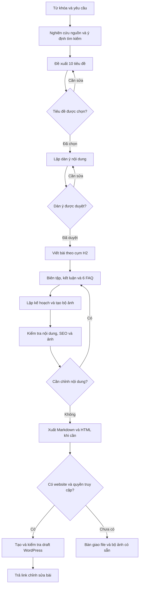
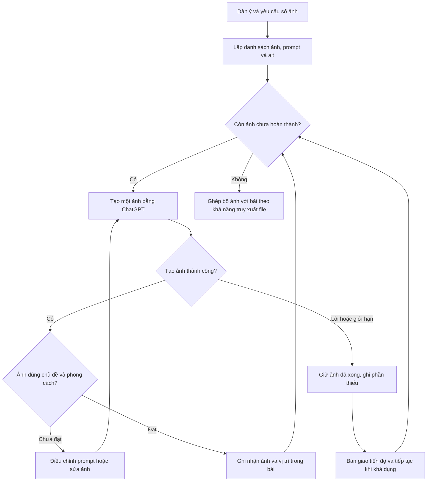

# SEO Blog Writer

**Từ một từ khóa đến bài blog SEO tiếng Việt, bộ ảnh minh họa bằng ChatGPT và bản nháp WordPress.**

[**Xem website giới thiệu**](https://sonlovinbot.github.io/seo-blog-writer-skill/)

SEO Blog Writer là skill hướng dẫn ChatGPT thực hiện quy trình viết bài: nghiên cứu nguồn, đề xuất tiêu đề, xây dựng dàn ý, viết nội dung, tạo ảnh và kiểm tra trước khi bàn giao. Phù hợp cho người làm content, marketing, chủ website và đội ngũ sản xuất blog tiếng Việt.

Ảnh được tạo bằng **tính năng tạo ảnh tích hợp của ChatGPT**, theo số lượng bài viết cần. Bước WordPress thực hiện khi có website được chỉ định và quyền truy cập phù hợp.

[Đọc hướng dẫn đầy đủ trong SKILL.md](SKILL.md) · [Mở skill đã cài trong ChatGPT](https://chatgpt.com/skills?skill_id=6a9992d4b6b481918e9e786f1e544565)

## Bạn nhận được gì?

- 10 gợi ý tiêu đề phù hợp với từ khóa và mục tiêu tìm kiếm.
- Dàn ý mặc định 9 H2 nội dung, có điểm duyệt trước khi viết.
- Bài viết tiếng Việt khoảng 1.800–2.500 từ, kèm kết luận và 6 câu FAQ.
- Bộ ảnh minh họa nhất quán về phong cách, prompt riêng và alt tiếng Việt cho từng ảnh.
- Meta title, meta description và file Markdown; HTML khi cần đưa lên WordPress.
- Bản nháp WordPress và link chỉnh sửa khi đã có kết nối phù hợp.

Số H2, độ dài, số ảnh, phong cách và cách duyệt đều có thể điều chỉnh theo yêu cầu của bạn.

## Flowchart tổng thể

Sơ đồ thể hiện hai điểm duyệt nội dung, vòng chỉnh sửa và hai cách bàn giao cuối quy trình.



**Chế độ có duyệt:** bạn chọn tiêu đề và duyệt dàn ý trước khi ChatGPT viết tiếp.

**Chế độ tự động:** khi bạn yêu cầu làm toàn bộ tự động, ChatGPT tự chọn tiêu đề và dàn ý, thông báo lựa chọn rồi tiếp tục. Nếu bạn đã cung cấp tiêu đề hoặc dàn ý, skill dùng phần đã chỉ định.

## Workflow từng bước

| Bước | ChatGPT thực hiện | Kết quả / tương tác |
|---|---|---|
| 0. Nghiên cứu | Đọc 3–5 nguồn liên quan, xác định ý định tìm kiếm, chủ đề phụ và khoảng trống nội dung | Ghi chú nguồn và hướng triển khai |
| 1. Tiêu đề | Đề xuất 10 tiêu đề dưới 120 ký tự, dùng từ khóa tự nhiên | Bạn chọn tiêu đề, trừ chế độ tự động |
| 2. Dàn ý | Lập mặc định 9 H2, mỗi H2 có 2–3 luận điểm | Bạn duyệt dàn ý, trừ chế độ tự động |
| 3. Viết bài | Viết theo cụm 2–3 H2, ghép và biên tập toàn bài; thêm mở bài, kết luận và 6 FAQ | Bản thảo hoàn chỉnh, có dẫn nguồn và bảng khi phù hợp |
| 4. Tạo ảnh | Xác định số ảnh, chuẩn bị prompt, tạo lần lượt bằng ChatGPT, kiểm tra từng ảnh | Bộ ảnh, alt và bảng ánh xạ vị trí |
| 5. Kiểm tra và xuất | Kiểm tra cấu trúc, nguồn, từ khóa, số ảnh và liên kết; viết metadata | File Markdown, HTML khi cần và bộ ảnh có thể truy xuất |
| 6. WordPress | Tải ảnh thực tế lên Media Library, tạo draft và đọc lại kết quả khi có quyền truy cập | Link sửa bản nháp; nếu chưa kết nối, bàn giao file |

Khi môi trường hỗ trợ subagent, phần viết bài có thể chia cho các agent theo từng cụm H2, rồi biên tập thống nhất. Nếu không có, ChatGPT viết lần lượt trong phiên hiện tại.

## Workflow tạo ảnh hàng loạt

Mỗi ảnh có một prompt riêng. Skill tạo lần lượt, kiểm tra và cập nhật tiến độ để có thể tiếp tục phần còn thiếu khi gặp lỗi hoặc giới hạn công cụ.



### Cách tính số ảnh

| Yêu cầu | Số ảnh sẽ tạo |
|---|---|
| Bài mặc định 9 H2, không chỉ định số ảnh | 9 ảnh nội dung |
| Bài 9 H2 và yêu cầu thêm ảnh bìa | 10 ảnh: 9 nội dung + 1 bìa |
| Bài 4 H2, yêu cầu 3 ảnh nội dung + 1 bìa | 4 ảnh, chọn vị trí minh họa phù hợp nhất |
| Chỉ định số lượng khác | Phân bổ theo yêu cầu và mục đích minh họa |

- Mặc định ảnh ngang 16:9, phong cách đơn giản và chuyên nghiệp.
- Không tạo ảnh cho kết luận hoặc FAQ; chỉ thêm bìa khi được yêu cầu.
- Ảnh lỗi hoặc biến thể bị bỏ không tính vào số ảnh hoàn thành.
- Nếu chưa truy xuất được file ảnh để ghép vào bài, bàn giao ảnh đã hiển thị và bảng vị trí, đồng thời nêu rõ phần chưa ghép.
- Với biểu đồ số liệu hoặc sơ đồ cần chính xác, dùng công cụ vẽ/plot phù hợp.

## Bắt đầu sử dụng

Mở skill trong ChatGPT và cung cấp từ khóa cùng các yêu cầu bạn đã biết. Skill chỉ hỏi thêm thông tin còn thiếu có ảnh hưởng thực sự đến bài viết.

### Có duyệt tiêu đề và dàn ý

```text
Dùng $seo-blog-writer viết bài về “AI marketing cho doanh nghiệp nhỏ”.
Độc giả: chủ doanh nghiệp Việt Nam.
Độ dài: khoảng 2.000 từ.
Cho tôi chọn tiêu đề và duyệt dàn ý trước khi viết.
Sau đó tạo 5 ảnh nội dung bằng ChatGPT, phong cách minh họa tối giản.
```

### Làm toàn bộ tự động

```text
Dùng $seo-blog-writer tạo bài về “cách xây dựng kế hoạch content marketing”.
Tự chọn tiêu đề và dàn ý, viết khoảng 2.500 từ với 9 H2.
Tạo 9 ảnh nội dung và 1 ảnh bìa bằng ChatGPT, tỷ lệ 16:9,
phong cách hiện đại, chuyên nghiệp.
Xuất Markdown và HTML. Nếu chưa có kết nối WordPress, giao file hoàn chỉnh.
```

### Tạo bản nháp WordPress

Cung cấp website đích và thiết lập quyền truy cập qua connector hoặc cơ chế xác thực an toàn mà môi trường hỗ trợ. Skill dùng trạng thái **draft** và trả link chỉnh sửa sau khi kiểm tra kết quả. Đăng công khai chỉ khi bạn yêu cầu.

## Công cụ cần có

| Khả năng | Công cụ sử dụng | Khi chưa khả dụng |
|---|---|---|
| Nghiên cứu | Tìm kiếm web trong môi trường ChatGPT | Dùng nguồn bạn cung cấp và nêu giới hạn nghiên cứu |
| Tạo bộ ảnh | Tính năng tạo ảnh tích hợp của ChatGPT | Báo ảnh còn thiếu, giữ prompt và phần đã hoàn thành |
| Xuất bài | Công cụ file/runtime | Nêu rõ phần chưa xuất được |
| Tạo draft WordPress | Connector phù hợp hoặc REST API đã cấu hình xác thực | Hoàn thành bản thảo và bộ ảnh có sẵn để bàn giao |

Việc cài skill cung cấp quy trình hướng dẫn; khả năng thực thi phụ thuộc công cụ thực tế trong phiên làm việc. Không cần API key Pexels hay API key tạo ảnh riêng cho tính năng tạo ảnh tích hợp.

## Cấu trúc repo

| File | Vai trò |
|---|---|
| [SKILL.md](SKILL.md) | Hướng dẫn thực thi toàn bộ quy trình |
| [agents/openai.yaml](agents/openai.yaml) | Tên hiển thị, mô tả ngắn và prompt khởi đầu |
| [assets/icon.svg](assets/icon.svg) | Tài nguyên biểu tượng |
| [index.html](index.html), [styles.css](styles.css) | Trang giới thiệu chạy trên GitHub Pages |
| [assets/share-preview.png](assets/share-preview.png) | Ảnh đại diện khi chia sẻ website |
| [README.md](README.md) | Giới thiệu, sơ đồ quy trình và ví dụ sử dụng |

## Nguyên tắc chất lượng

- Nguồn và thông tin có thể kiểm chứng; không sao chép bài đối thủ hoặc bịa số liệu.
- Từ khóa phân bố tự nhiên, không áp mật độ phần trăm cứng.
- Kiểm tra lại toàn bài để tránh lặp ý giữa các cụm H2.
- Không hứa thứ hạng tìm kiếm.
- Không lưu thông tin xác thực trong skill, bài viết hoặc repo.
- Chỉ báo hoàn thành những bước đã thực hiện và kiểm tra được.

Xem [SKILL.md](SKILL.md) để đọc đầy đủ các quy tắc và xử lý tình huống.
